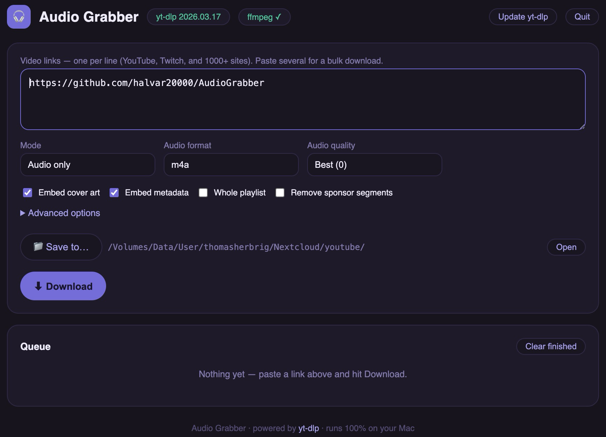

# Audio Grabber 🎧

A simple, clean GUI for [yt-dlp](https://github.com/yt-dlp/yt-dlp). Paste video links from YouTube, Twitch, and 1000+ other sites — get audio files (mp3, m4a, opus, flac, wav) or videos. Bulk downloads, live progress, zero clutter.

Built because the great yt-dlp GUIs out there kept growing features, and sometimes you just want to paste a link and press one button.



## Highlights

- Paste **many links at once** — they queue up with live progress, speed, and ETA
- Audio formats with embedded **cover art and metadata tags**
- Video mode too (resolution cap, mp4/mkv, subtitles)
- Playlists, SponsorBlock segment removal, time ranges, speed limit, cookies-from-browser for member-only videos — plus a free-text field for **any other yt-dlp flag**
- Auto-installs and updates its own yt-dlp copy (no separate install needed)
- Clipboard auto-paste, desktop notification when a download finishes
- 100% local: a tiny Python server on `127.0.0.1` with a browser-based UI in a clean app window. No accounts, no telemetry, no Electron.

## Requirements

- **Python 3.9+** — preinstalled on macOS (with developer tools) and Linux; on Windows get it from [python.org](https://www.python.org/downloads/) (check "Add python.exe to PATH")
- **ffmpeg** — needed for audio conversion: `brew install ffmpeg` (macOS), `sudo apt install ffmpeg` (Debian/Ubuntu), `winget install ffmpeg` (Windows). Without it, the "best" format still works.

## Run it

Download or clone this repository, then:

| OS | Start |
|---|---|
| **macOS** | Double-click `Audio Grabber.app` |
| **Windows** | Double-click `Audio Grabber - Windows.bat` |
| **Linux** | Run `./audio-grabber-linux.sh` |

On first start it downloads the latest yt-dlp automatically. The app window closes itself a few minutes after you close the UI (never during a download).

**macOS note:** if the app won't open ("can't be opened"), run once in Terminal:

```
chmod +x "Audio Grabber.app/Contents/MacOS/launcher"
xattr -dr com.apple.quarantine "Audio Grabber.app"
```

**Note on the folder layout:** the program source for all platforms lives inside `Audio Grabber.app` (a macOS app bundle is just a folder) — the Windows and Linux launchers start the same `server.py` from there.

## When downloads stop working

Video sites change constantly. Click **Update yt-dlp** in the app — that fixes it 95% of the time.

## License

MIT. Only download content you're allowed to download.

---

*Built with [Claude](https://claude.com).*
